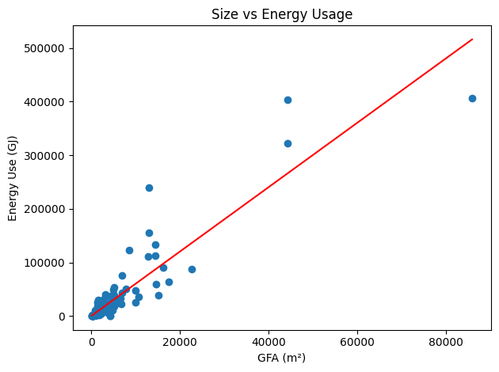
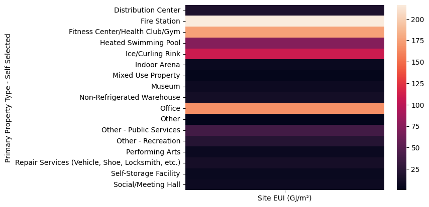
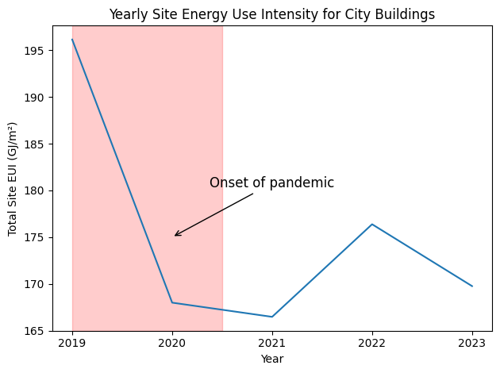
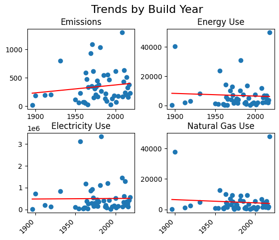

# Building Energy Benchmarking

### Data 
The city of Calgary provides data on buiding energy and greenhouse gas performance for a subset of properties that the city owns and operates. The energy consumption data is recorded by Energy Star portfolio managers. The Name and address information is provided for each building, reported building size and property categorization, as well as year built. Additionally, various measures of energy use, electricity use, natural gas use, and emissions data is provided for each building, for each year.

### Tools
The data was loaded, inspected, and cleaned using a Jupyter notebook environment and popular Python data analysis libraries including pandas, NumPy, re. Visualizations were produced using matplotlib and seaborn. 

### Methods
Columns containing data in less than 40% of their rows were dropped. Numerical columns with 0-40% data were imputed with the median for their respective columns. Many numerical columns in this set were stored as text types with added ',' characters and inconsistent type. RegEx replacement was used with `re.sub()` to remove commas, then cast numerical data to float type.

Address data was another area of concern for RegEx cleaning. Postal code data was cleaned using `re.sub()` to remove any spaces, then cast to uppercase. The proper formatted "T2X 1GH" data standard was then reconstructed using an f-string to display the first three characters, a space, then the next three using slicing. The address column had inconsistent casing, street abbreviations, and format. The address column was split using four capturing groups, one each for street number, street name, street type, and quadrant. Number was captured, then type, then quadrant, leaving the leftover portion as street name. Street types were further cleaned by forcing consistent abbreviation (ie AV, not Ave or Avenue). Finally, a clean address column was constructed from the four split, cleaned columns. 

### Conclusions
In general, the main factor determining the energy consumption of a building in Calgary is its size and purpose. In the graph below we see the increasing linear relationship between size and energy usage:

Additionally, we can see that the purpose effects energy consumption when inspecting this heatmap that compares property type to energy use/building size:

In examining yearly trends we can see that Calgary owned buildings saw a strong downward trend with the onset on the pandemic. This is likely due to the closure of many shared public spaces that were deemed unsafe during that time. The usage Calgary-wide shows a slight recovery since the end of the pandemic, but have not fully recovered to pre-pandemic levels.

We do not see much, if any relationship between the year of build and the energy consumption of a building. It is likely that most buildings of high age in the city have been retrofitted with modern equipment and standards, mitigating the effect of out of date building standards.

If the city wants to reduce its usage, it is best to focus on building smaller buildings in the future. Where large buildings are necessary, or those with high energy consumption purposes are to be built, focus should be placed on energy reduction as these promise the most potential ROI.